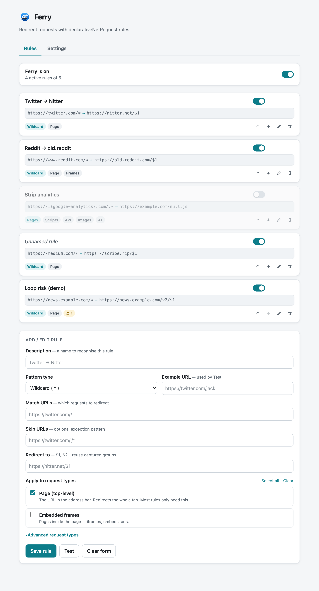
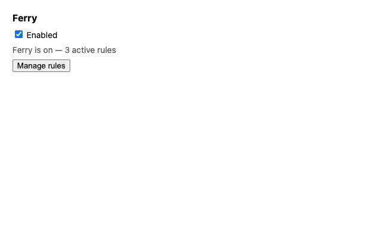
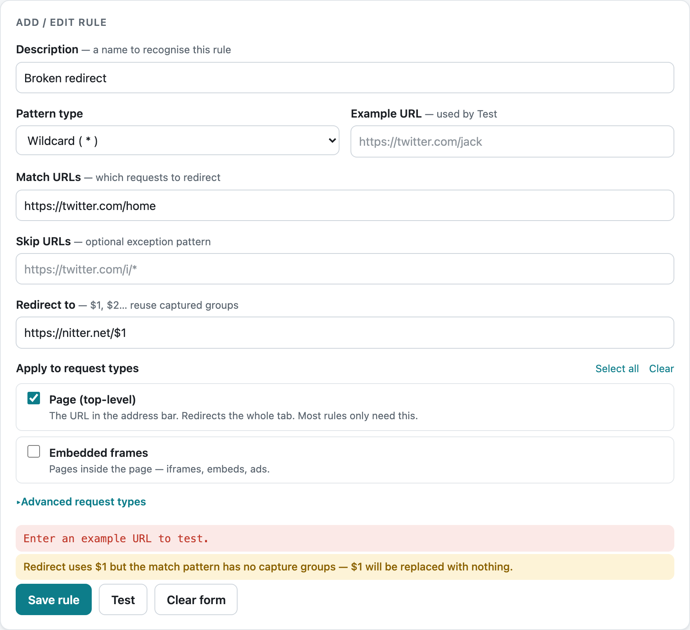

TLDR: I built [Ferry](https://github.com/pedrosousa13/ferry) as a fast, private URL redirector for Chrome and Firefox. It uses Manifest V3's `declarativeNetRequest` API, so redirects happen natively in the browser. There is no JavaScript in the request path, which means the extension never observes the URLs you visit. No telemetry, no network calls.


I got tired of x.com and wanted every link to open in [xcancel](https://xcancel.com) instead. That is a one-line rule. Looking for an extension to do it, everything I found wanted to watch my whole browsing session to pull off a simple find-and-replace. So I built my own.

The usual redirector pattern is simple and invasive. The extension listens to requests, inspects each URL, and rewrites the ones that match. That works, but it means a background script sees every page you load.

I wanted Ferry to do the same redirects without ever being allowed to watch the requests it acts on.

## Table of contents

## The problem

A redirector has one job. x.com should open in xcancel. A tracking link should skip the tracker. A work domain should point at a staging host.

The awkward part is how most extensions do it. They ask for broad request access, run a background listener, and decide per request whether to redirect. Once an extension can see every request in order to redirect it, it can also just watch you, and you're taking its word that it doesn't.

For a tool that runs on every request, that is a lot of trust to ask for.

## Native redirects

Ferry pushes the rules down to the browser.

`declarativeNetRequest` lets an extension register redirect rules once. The browser then matches and rewrites requests itself. The extension is not in the loop when a request is made.

So the usual arrangement flips around:

- no background listener on the request path
- no per-request JavaScript
- no place for the extension to read the URL
- the rules are plain data the browser reads, not code that runs

The browser is the one enforcing the rules. Ferry only supplies them.

## Writing a rule

A rule is a pattern and a target. `https://x.com/*` becomes `https://xcancel.com/$1`. You can scope it to specific resource types.



Rules apply instantly. There is no reload step and no service worker to restart. Change a rule, and the next matching request follows it.

The options page is the whole product surface. It is a list of rules with the pieces a rule needs, and not much else.

## Pause without uninstalling

Sometimes a redirect gets in the way. You want the real site for one task.



The popup toggles the whole extension off. Rules stay defined; they just stop applying until you turn them back on. When you want the real site for a minute, you shouldn't have to go edit or delete a rule to get there.

## Preview before you save

Redirect rules are easy to get subtly wrong. A pattern is too broad, or a target drops part of the path.



Ferry can test a rule before it goes live. You see what a sample URL would become, and obvious mistakes get flagged before they start silently sending you to the wrong place.

## It can't watch you

Most extensions ask you to trust a privacy policy. Ferry doesn't really need one.

The redirect rules live entirely in `declarativeNetRequest`. Ferry hands them to the browser once and then steps out of the way. There is no point in the flow where it reads a URL you visited, so there is no browsing data for it to log or send anywhere. The [privacy document](https://github.com/pedrosousa13/ferry/blob/main/PRIVACY.md) spells this out, but the code is the real answer.

That is the part I like most. The guarantee holds even if you don't trust me, because I never wired up a way to collect anything in the first place.

## Tradeoffs

Staying pure `declarativeNetRequest` costs some flexibility.

- No capture-group transforms. You cannot base64-decode or URL-decode part of a match.
- No SPA history-state redirects. A pattern only fires on a real page load, not on in-app navigation.

Hard loads still redirect correctly, which covers most of what a redirector is for. When you import rules from another extension, Ferry skips any that need transformations it cannot express.

These are real limits, and I hit a couple of them myself. But they come straight from the choice to keep everything in the browser's hands, which is the same choice that keeps Ferry out of your browsing.

## What I learned

I started out planning the obvious version: a background listener that inspects requests and a privacy policy explaining that I don't do anything shady with them. `declarativeNetRequest` let me skip that entirely and hand the whole job to the browser.

I gave up a bit of flexibility for it, and for a while I wasn't sure that was the right call. In practice I haven't missed the features I dropped, and I like that there's no version of the code where Ferry could quietly start logging where I go. Less for me to get wrong later.

## Try it

Ferry is available for both browsers:

- [Chrome Web Store](https://chromewebstore.google.com/detail/ferry/mnlbkdldfkcafbokmipkeegheaaldmgd)
- [Firefox Add-ons](https://addons.mozilla.org/en-US/firefox/addon/ferry-private-url-redirector/)
- [GitHub](https://github.com/pedrosousa13/ferry)

Or build from source and load it unpacked:

```sh
npm install
npm run build
```

This creates `dist/chrome` and `dist/firefox`. Load the matching folder via `chrome://extensions` (enable Developer mode) or `about:debugging#/runtime/this-firefox` on Firefox.
