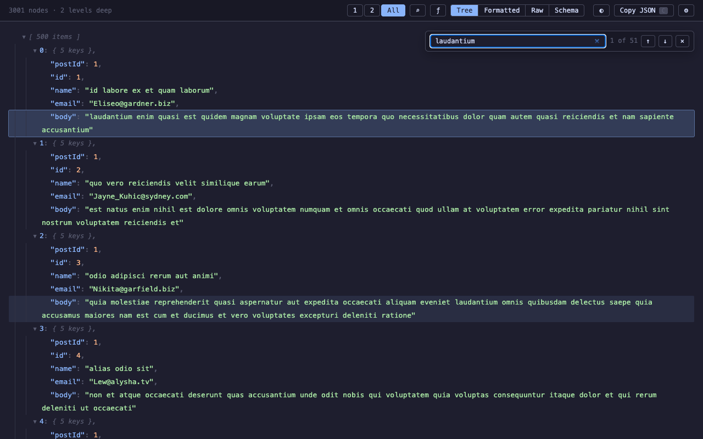
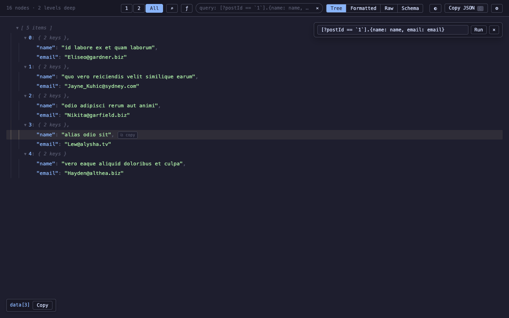
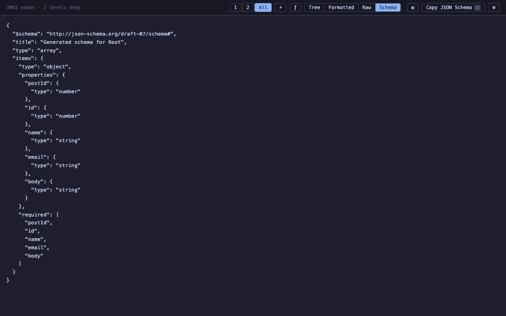
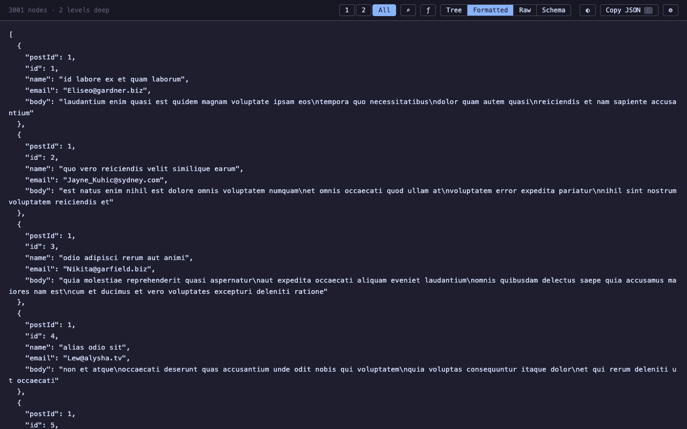

TLDR: I built [JSON Bonsai](https://github.com/pedrosousa13/JSON-Bonsai) to make large JSON payloads easier to inspect in the browser. The focus is navigation: a fast tree, search, queries, table view, schema view, copyable paths, and safe handling of large numbers.

JSON Bonsai started from [JSON Alexander](https://github.com/wesbos/JSON-Alexander), Wes Bos's small JSON viewer. I liked the core idea: open JSON in the browser and get a clean tree instead of raw text.

The next direction came from JSON Alexander's issue list. People wanted search, keyboard shortcuts, table or transform views, schema view, better copy actions, clickable links, long-string handling, raw-view fixes, and store distribution.

That backlog pointed at a clear problem. Displaying JSON was the starting point. The next step was making it workable.

## Table of contents

## The problem

Small JSON responses are easy to read. Large ones are different. You are usually looking for one branch, one ID, one broken field, or one shape inside a big response.

At that size, a viewer should help you move through the payload. Expanding everything is noise. Rendering everything is waste. Searching on the main thread makes the browser feel broken.

JSON Bonsai treats the payload as something to navigate, not as a pretty blob of text.

## Render less

The tree is virtualized. The page only renders the rows that matter for the current viewport.

That changes the internal model. Instead of recursively mounting the whole object, the app keeps expansion state and derives a visible row list from it.

That row model makes the UI cheaper to update:

- scrolling does not create thousands of DOM nodes
- expanding a branch updates the visible rows
- row actions stay local
- the browser spends less time on hidden data

It also forces better controls. If "expand all" is no longer the default escape hatch, depth controls and clear collapse behavior matter more.

## Search and query

Search runs in a web worker so the UI stays responsive while the payload is scanned.

Search looks across keys, values, and paths. Results need navigation. If a match exists, the viewer should take you there and keep enough context around it.

Queries solve a different problem. Search asks "where is this?" A JMESPath query asks "what subset do I want to inspect?"

JSON Bonsai lets query results use the same tools as the original payload. Tree, table, copy, and search still work after the query runs.

The "query from here" action is important. Query languages are powerful, but starting from a blank input is slow. Starting from the selected node gives the user a useful path immediately.

## Keep the data honest

JSON numbers can be larger or more precise than JavaScript can safely represent.

That matters for API payloads. IDs, decimals, and external values should not change because a viewer opened them.

JSON Bonsai preserves large number literals for display and copy. A viewer is an inspection tool. It should not quietly rewrite what the server sent.

## Views that answer questions

Tree view is the default because JSON is nested. It is not always the best answer.

Arrays of objects often read better as tables. Raw view is useful when exact output matters. Formatted view is useful for copy and comparison. Schema view helps when the payload is unfamiliar.

Each view has a job:

- Tree: inspect nested structure
- Table: compare similar objects
- Formatted: read the document as JSON
- Raw: see the original output
- Schema: understand the shape

That kept the extra views from becoming decoration. A view earns its place when it makes one task simpler.

## Tradeoffs

JSON Bonsai is still a browser extension. It cannot make unlimited data free. It can only avoid paying for work too early.

There is also a privacy tradeoff. Exposing the payload as `window.data` is convenient, but it changes what page scripts and other extensions can see. JSON Bonsai keeps that off by default.

## What I learned

The useful model should have come earlier.

Tree rows, search results, query results, table rows, copied paths, and schema inference all talk about the same thing: a node in a document.

Once that model is clear, the features fit together. Performance gets easier too, because the UI can answer user questions without reshaping the whole payload every time.

## Try it

JSON Bonsai is available for Chrome and Firefox:

- [GitHub](https://github.com/pedrosousa13/JSON-Bonsai)
- [Chrome Web Store](https://chromewebstore.google.com/detail/json-bonsai/dpcomlfdaamelgcgnalkfomdfpmioeml)
- [Firefox Add-ons](https://addons.mozilla.org/en-US/firefox/addon/json-bonsai/)
